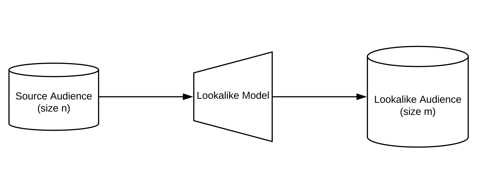
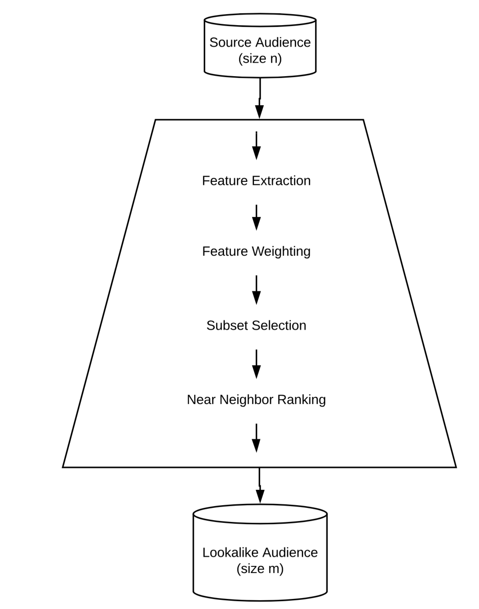
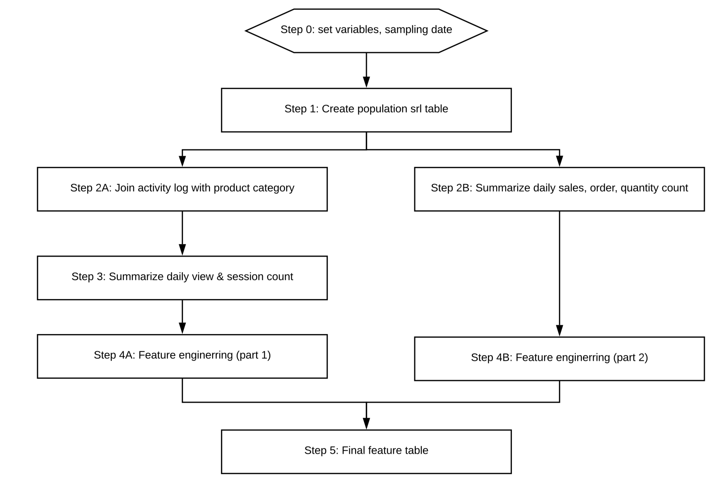
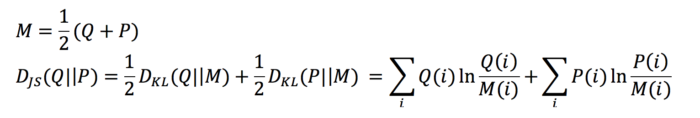
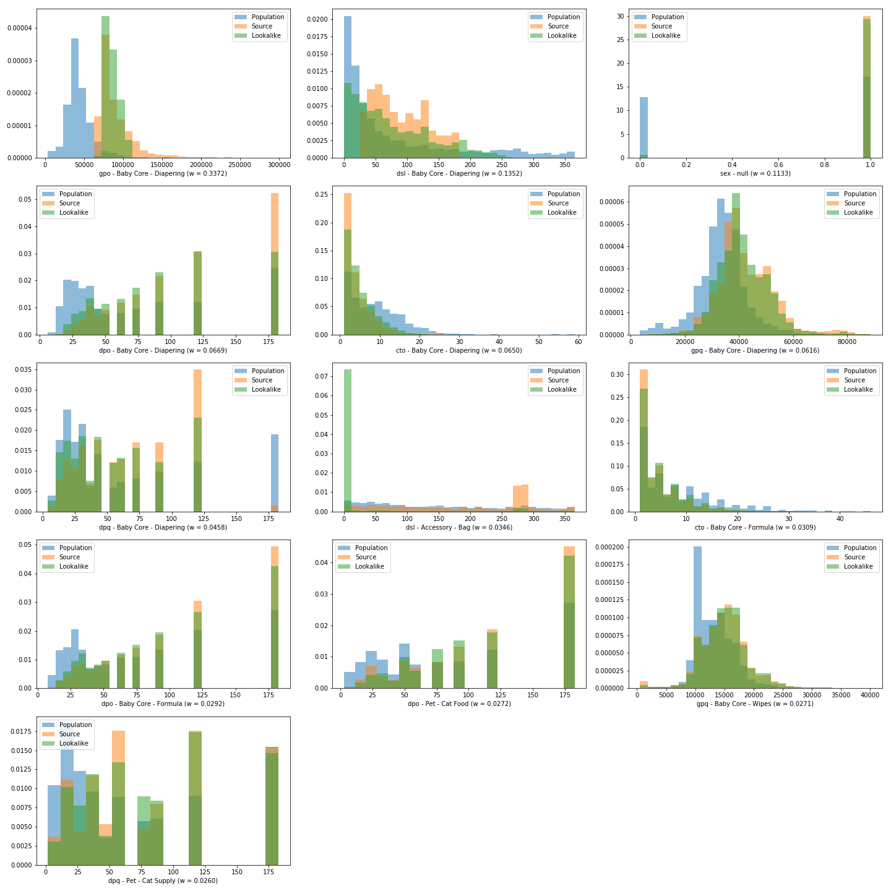

## Lookalike Model
### Introduction
Traditional segmentation approach applies hard filters to population, such as age range, account monetary value, and purchase frequency, to create segments. Because all filters must be satisfied, only the intersection of all filters remains. This methodology has two disadvantages.

1. On one hand, hard filters may introduce human bias. For example, when promoting a baby product, requiring seed audience to be all females will leave out male customers who tend to their babies on their wives' behalf, or female customers who did not declare their gender on Coupang. If such bias is feed into Facebook Lookalike Audience, lookalike audience will all be females too.

2. On the other hand, hard filters reduce the population so fast that only a few hundred customers remain after applying just a few filters. As the number of filters increases, the size of segment shrinks exponentially. When a segment becomes too small, it represents a too specialized set of customers who may not generalize to a meaningful persona to build lookalike audience.



The objective of this project is to build a lookalike model that "softens" the filters, and accounts for the underlying statistical structure of different metrics a.k.a. features. The assumption is that all features are not independent, as commonsense affirms (if all features are independent, applying hard filters would generate the most accurate segment).

Still, human bias is often helpful. Since the initial segments must be defined by the business team, in accordance with a specific business goal, such bias often aligns (albeit imperfectly) with the business goal. The role of the lookalike model is to take the initial segments as input, inspect its underlying structure, assign weights to features, build a larger segment using unsupervised machine learning, and output the enlarged segment to be used as source audience for Facebook Lookalike Audience service. For example, knowing that most diaper buyers are women is a meaningful piece of information, but the lookalike model will override the human bias that "diaper buyers must be female" if some male customers were found to conform to most of other features of the initial segments.

___
### Workflow
Input source audience: an initial segment as a list of member_srls. The initial segment is defined by some hard filters chosen by the business team. Filters are selected for a specific business goal (e.g. promoting a particular product line). Notice: the lookalike model does __NOT__ take filters as input.

1. Features extraction: for each customer in the initial input segment, a full list of features is retrieved.
2. Feature weighting: for each feature, Jensen-Shannon divergence is computed and assigned as weight. 
3. Subset selection: the top 20 features with highest weight are used for the next step.
4. Near Neighbor Ranking: compute average of the initial segment as centroid, rank its nearest neighbor by a distance metric (Euclidean, cosine, Mahalanobis, etc.).
5. Output lookalike audience: a set of lookalike audience larger than the initial input. The sized of lookalike audience can be arbitrarily set to n. The top n customers most similar to the initial segment are returned.

<p align="center">
    
</p>

___
### Feature Extraction

The full model includes 1805 features, which are computed primarily based on bimart.cs_sales and indexing_platform.user_behavior_log. Because the indexing_platform.user_behavior_log table is huge, it is impossible to compute 1805 features for the entire population of approximately 11 million customer (after 12 hours, the task is killed). Instead, the sql must be run on private cluster using Zeppelin Sandbox.

The partial model includes 957 features, which are computed based on bimart.cs_sales in Redshift. The 957 features (9 * 106 + 3) are highlighted by red colors in the table above. It takes about 30 minutes to finish the entire feature extraction process on Redshift.

The redshift SQL commands are syntactically different from Hive SQL commands, both versions are (hopefully) bug-free. Refer to README.txt in the [sql_hive](sql_hive/README.txt) and [sql_redshift](sql_redshift/README.txt) directories for detailed explanations on how to use the files.

* Need: annualized aggregate spending (aas), annualized order count (cto), annualized quantity count (ctq), days per order (dpo), day per quantity (dpq) quantify customer's need for each product category.
* Habit: annualized view count (ctv) measures indirectly how much interests a customer places in each product category.
* Engagement: view per order (vpo), view per quantity (vpq) measure how much attention a customer spends on looking for the best offer in each product category.
* Spending power: GMV per order (gpo), per quantity (gpq), per day (gpd) measure how much a customer is willing to spend (per unit order / quantity) in each product category.
* Churn: days since last order (dal), views since last order (vsl) measure how likely a user is going to place the next order in each product category.

<p align="center">
    
</p>

### Naming Convention
Each feature is referred to as symbol + category code, in which category code is padded with 0 to the front to maintain a consistent 3-digit code. For example, "cto078" refers to annualized order count in category 78 (Overseas Travel - Ticket/Pass). Use the script here to generate names for all features. An exhaustive list of 1805 feature names can be found [here](data/feature_code.csv) as a csv file.

### Weighting
The model uses Jensen-Shannon divergence (JS divergence) to measure the importance of each feature. In probability theory and statistics, the Jensen–Shannon divergence is a method of measuring the similarity between two probability distributions. The intuition is that for a given feature, the more extremely the source audience diverges from the population distribution, the more significant the feature is in defining the source audience, and hence a higher weight is assigned to the feature.

The model computes JS divergence for every feature of the source audience, compared against the population sample. The features with highest JS divergence are selected. In the python class, parameter max_features specifies the number of top features with highest JS divergence; parameter threshold specifies the minimum JS divergence required to be considered as meaningful divergence. If none of the features exceeds minimum threshold, no feature is selected. If more than max_features number of features exceed the minimum threshold, the top max_features features are selected. The final feature weights are computed by normalizing JS divergence of valid candidate features.

<p align="center">
    
</p>

Warning: you must have at least 1 feature with meaningful divergence for the lookalike model to proceed. Empirically, a good range of features is 5 ~ 15. The default max_features is set to 20, beyond which joining table (10 million rows, one per customer) successively takes exponentially more time. The default threshold is set to 0.05, below which divergence is more likely caused by noise, not by source audience characteristic.

### Lookalike Ranking
The average of the selected features of the source audience is computed as the Persona––a portrait of an imaginary customer that represents an entire group of customers so that the company can focus its effort. Every customer in the population is ranked by his Euclidean distance to the Persona. The lookalike audience of size m is generated by returning the top m customers with lowest Euclidean distance. 

### Maintenance
The full feature table does not have to bee updated frequently, as the features of a customer (need, habit, engagement, purchasing power, etc.) do not change drastically every day. The full feature table can be rebuilt on a weekly basis or bi-monthly basis without significant degradation of performance.

___
### How to use
#### Step 1
Connect to pang-SFO. You cannot use Coupang's guest wifi, or home wifi. Connect VPN if necessary.

#### Step 2
If using Redshift, run SQL commands sequentially in sql_redshift foldler. For detailed instruction, refer to this [guide](sql_redshift/README.txt).

If using Hive, run SQL commands sequentially in sql_hive foldler. For detailed instruction, refer to this [guide](sql_hive/README.txt).

#### Step 3
Install Anaconda for Python 3. Launch Jupyter Notebook, and download required libraries.
* os
* math
* scipy
* timeit
* numpy as np
* pandas as pd
* scipy import stats
* psycopg2
* sqlalchemy import create_engine

#### Step 4
Run [setup.ipynb](/setup.ipynb) to download feature table and population sample. This step must be completed before the Lookalike Modelcan be run.

#### Step 5
Refer to [test_mom.ipynb](/test_mom.ipynb) for an example on expanding a high-value mom cohort seed audience. Similarly, refer to [test_pet.ipynb](/pet_mom.ipynb) for an example of expanding pet-owner seed audience.

___
#### Run the model in command line
The [script.py](/script.py) can be directly run in command line. Before directly running the script, a python kernel must be setup with all required libraries. 
1. Create kernel with required libraries:
```bash
conda create --name LookalikeKernel python=3 pandas numpy sqlalchemy scipy matplotlib psycopg2
```

2. Activate kernel
```bash
conda activate LookalikeKernel
```

3. Running the script
The script takes five arguments:
* input_file_name: the source audience file should be stored in input folder, with exactly one column, and header "member_srl."
* output_dir_name: this is the name of the folder to be created in the output folder, which stored all output files for the given source audience (see Output section below).
* max_feaures: maximum number of features to include in the top features (see Weighting section above).
* threshold: minimum JS divergence for the feature to be considered a valid candidate feature, whose divergence from the population is meaningful (see Weighting section above).
* lookalike_audience_size: the size of the lookalike audience to include in the output.
Arguments are separated by a single space. In the example below, the source audience member_srls are saved in the test_src_srls.csv file. The Lookalike model is instantiated with maximum 20 features, minimum 0.05 threshold, and outputs 30000 lookalike audience. All outputs are saved to the output/test_src_srls folder.

```bash
python script.py "test_src_srls.csv" "test_src_srls" 20 0.05 30000
```

4. Deactivate kernel
```bash
conda deactivate
```

5. Delete kernel (if needed)
```bash
conda env remove --name LookalikeKernel
```

___
### Interpreting Results
Suppose we want to target mom customers, and we use the following criteria to generate source audience: 
```sql
SELECT DISTINCT member_srl
FROM sb_marketing.sl_lookalike_features_final
WHERE category = 'Baby Core - Diapering'
    AND sex = 1
    AND gpo > 70000
    AND dsl BETWEEN 30 AND 180
    AND age BETWEEN 25 AND 35;
```

The top features, with ranking assigned, can be found [here](/output/mom_src_srls/top_features.csv).

The Lookalike Model assigned highest weights to the filters used to generate the source audience (gpo015 – GMV per order,  dsl015 –  days since last order, sex000 – sex), and included correlated features in the final ranking: dsl001 – Accessory - Bag, cto016 – Baby Core - Formula, gpq017 – Baby Core - Wipes. The correlated features are clearly relevant to the source audience, who are supposed to be mothers. But these features are missed by the SQL command used to generate the source audience. Hence, it's fair to claim that the Lookalike Model is more comprehensive.

To check that the lookalike audience accurately captures the distinguishing characteristics of the source audience, we may examine the histograms for the top features. If the distribution of lookalike audience is closer to the source audience than to the population, then the lookalike audience is similar to the source audience. For example, the in the gpo015 feature below, both source audience and lookalike audience are truncated at 70000, meaning that the differentiating criteria is upheld. The dsl feature doesn't observe a clear cuts on upper and lower ends, but observes a fatter tail, shifting toward the source audience direction. For the sex000 feature, lookalike audience is mostly females, compared to the 100% female source audience.

Generally, when the population distribution is normal, lookalike audience's shift to source audience is exhibited as a shift of mean (see gpq015 - Baby Core - Diapering below). When the population distribution is exponential, the lookalike audience's shift is exhibited as a flattened exponential distribution, with a fatter tail.

Note that the shape of histogram depends on the lookalike audience size. The more lookalike audience, the more its shape converges to the population (if the lookalike audience is chosen to be the same size of the population, then the two become exactly identical).

<p align="center">
    
</p>

___
### Caution
The model is most useful when the goal is to understand the source audience's concern on specific product category or range of product categories. Simply select source audience based on account value, gender, platform, or registration time will should not produce any meaningful insights from the source audience.

If you see the following warning from python script, it means there is none of the features has observed a substantial deviation from the population, meaning that no feature that can tell the source audience apart from the population. The likely causes is that the definition of source audience is too general. In this case, consider adding stricter rules in selecting source audience. A direct, but less reliable way is to drop the threshold for Jensen-Shannon divergence, but keep in mind that if js_div is less than 0.05, it would be difficult to tell if the divergence is due to signal or noise. 


```
Critical Error:
No feature observes a significant divergence from population. Lookalike model cannot proceed.
Rerun selectTopFeatures() with lower js_div threshold or rebuild source audience with higher signal-noise ratio.
```

The recommended size of source audience is between 5,000 and 50,000. Too few customers will not likely provide sufficient data to estimate probability distribution for each feature. Too many customers will result in distributions that are generally similar to the population distribution for most features. Note that the recommended source audience size is the effective source audience size, not the input size: it is not helpful to randomly select 5,000 customers out of a large segment of 500,000 customers. The effective audience siz would be 500,000 in this case, which is too general (~4.5% of all Coupang customers). 

If source audience is generated using SQL query, be careful about how the rows of the table you're querying from are indexed and sorted. The sorting method can introduce unexpected signal pattern which the lookalike model WILL pick up. For example, if the table is ordered by most recent active date, then a "LIMIT" clause will return the most recent (or distant) active customers. Such signal will cause the distribution of "day since last order" of the source audience to be very different from the rest of the population, because customers who are recently active are likely to have smaller values in "day since last order" feature. To avoid such implicit filter effect, you may want to use the "TABLESAMPLE" SQL function.

Finally, before using the lookalike audience for any purpose, remember to examine the what top features are selected, what weights are assigned and histograms plot to see if the results violate commonsense.
